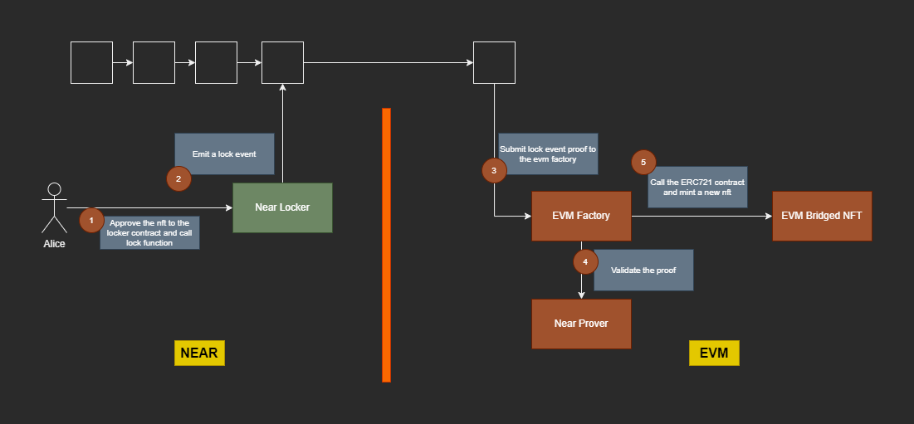
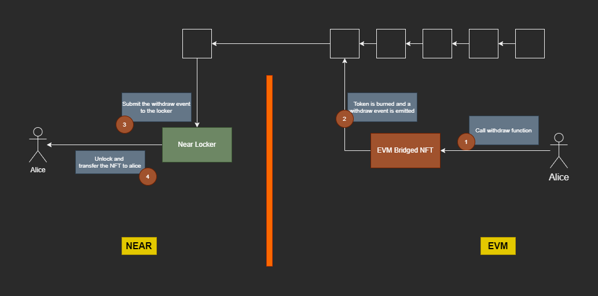
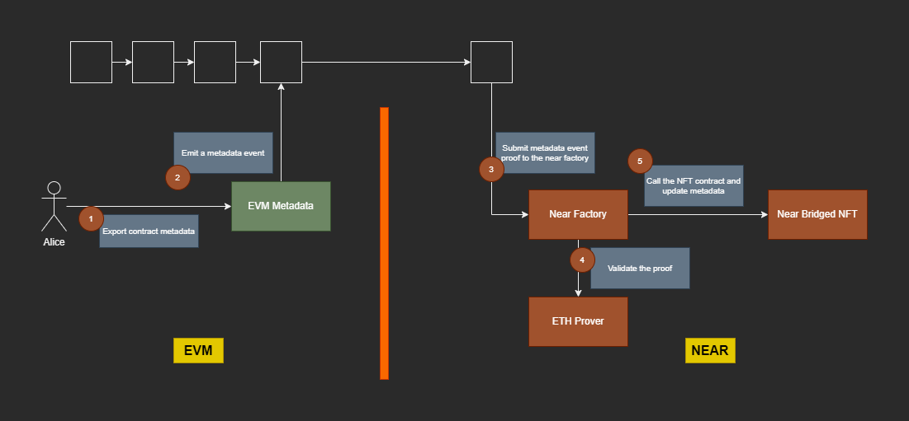

# rainbow-non-fungible-token-connector

# Near<>EVM NFT Connector:

## EVMFactory:
The EVM factory allows deploying new ERC721 contracts as a BidgedNFT. Only the factory can mint a token or update contract metadata by making a cross contract call to the specific BridgedNFT contract.

## BridgedNFT:
This contract is a full ERC721 contract. This contract is deployed through the EVM factory, only the factory can mint a new token or update the metadata.

## NearLocker:
This contract allows locking and unlocking the NFT tokens on the Near chain. 

## NearMetadata:
This contract allows exporting the Near NFT contract metadata.

## Transfer NFT to EVM

## Export Metadata to EVM

## Withdraw NFT from EVM to Near

# EVM<>Near NFT Connector:

## NearFactory:
The Near factory allows deploying new NFT contracts as a BidgedNFT. Only the factory can mint a token or update contract metadata by making a cross contract call to the specific BridgedNFT contract.

## BridgedNFT:
This contract is an NFT contract. This contract is deployed through the Near factory, only the factory can mint a new token or update the metadata.

## ERC721Locker:
This contract allows locking and unlocking the NFT tokens on the EVM chains. 

## ERC721Metadata:
This contract allows exporting the ERC721 contract metadata.

## Transfer NFT to EVM

## Export Metadata to EVM

## Withdraw NFT from EVM to Near
